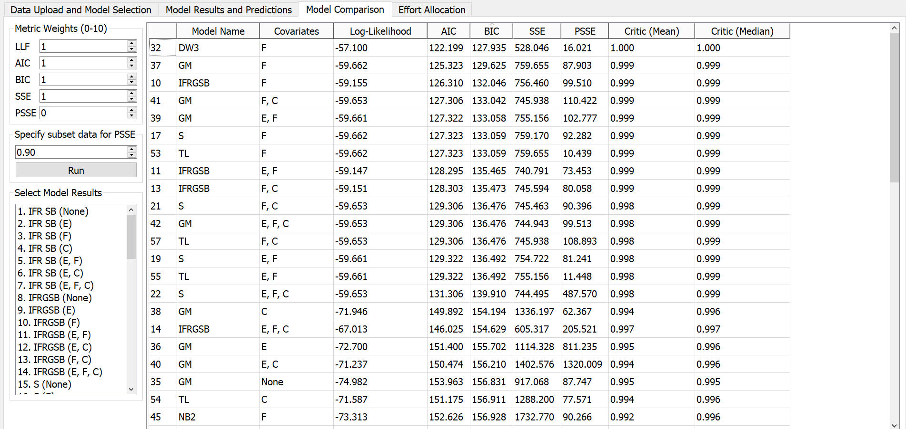
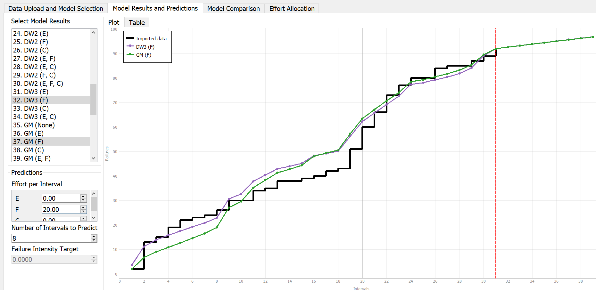
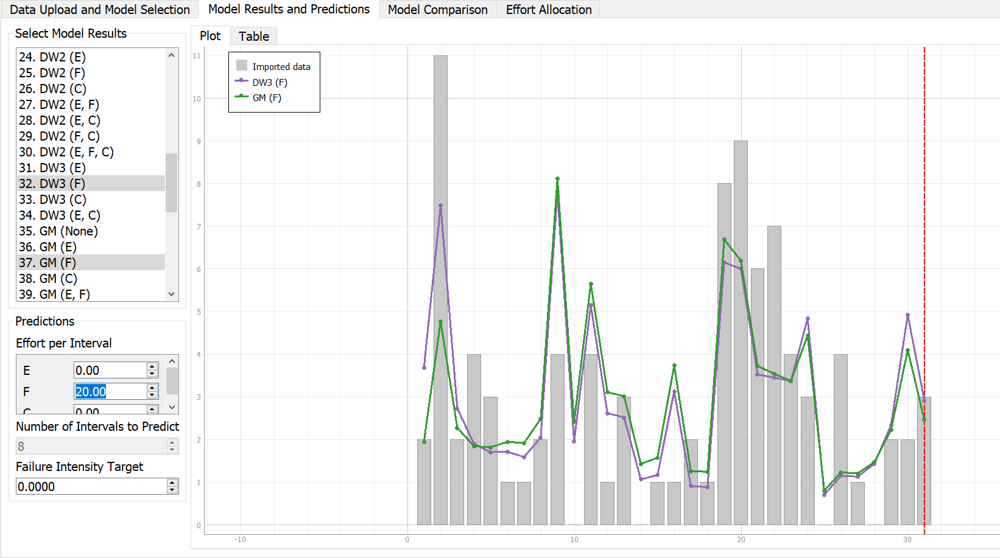

**SENG 637- Dependability and Reliability of Software Systems***

**Lab. Report \#5 – Software Reliability Assessment**

| Group \#:      |  5  |
| -------------- | --- |
| Student Names: | Lawrence |
|                | Kwesi |
|                | Joe |
|                | Zhanzhi |

# Introduction
This lab analyzes integration test failure data using two reliability assessment approaches: Reliability Growth Testing and Reliability Demonstration Charts (RDC). Reliability growth testing models how failure intensity changes over time as faults are detected and fixed, while RDC evaluates whether the system meets specified reliability targets. Together, these methods provide both analytical insight and decision support for assessing the reliability of the system under test (SUT).

# Assessment Using Reliability Growth Testing 
Reliability growth testing helps estimate time, cost, and trends for improving product reliability through corrective actions.
We want a model that explains our data well but doesn’t overfit or add unnecessary complexity. This is where AIC and BIC come in. These criteria help us balance accuracy with simplicity, guiding us to the model that best fits the data without over-complicating things.

## Model Comparison (selecting top two models)

AIC (Akaike Information Criterion)
Akaike Information Criterion (AIC) is a measure used to evaluate models by balancing fit and complexity.
AIC measures how well a model fits the data, while penalizing for complexity.

BIC (Bayesian Information Criterion)
Bayesian information criterion (BIC) or Schwarz information criterion (also SIC, SBC, SBIC) is a criterion for model selection among a finite set of models. 
BIC is similar to AIC but applies a stronger penalty for complexity, especially as sample size increases.

Generally models with lower AIC or BIC are generally preferred.

A set of candidate models was evaluated using multiple selection criteria, including log-likelihood, Akaike Information Criterion (AIC), Bayesian Information Criterion (BIC), and error-based metrics such as SSE. Among all models, DW3 (F) and GM (F) emerged as the top two based on their superior performance.
After analyzing the Model Comparison tables from C-SFRAT, we determined that the Discrete Weibull Type 3 model, with covariate F is the best model, with AIC of 122.199 and BIC of 127.935. The second best is the Geometric Model with covariate F with AIC of 125.323 and BIC of 129.625.

## Cumulative Failure (MVF) Plot with Model Predictions (DW3(F) and GM(F))

Based on the provided dataset (failure-dataset-a5.csv), the file contains 31 test intervals (T = 1 to 31).
Applying Sturges' Rule — k = 1 + log₂(n) — to the total number of intervals (n = 31)
k = 1 + log₂(31) = 5.95 ≈ 6 intervals

Applying Sturges’ Rule to the number of test intervals (n = 31) yields approximately 6 intervals. However, due to the non-uniform distribution of failures and the presence of a mid-phase spike, 8 intervals were selected. This allows for better resolution of changes in failure intensity while still maintaining reasonable smoothing.

## Failure Intensity Plot with Model Fits (DW3(F) and GM(F))

An effort interval of 20 for covariate F was selected based on the observed distribution of failures. A significant concentration of failures occurs at higher F values (≥ 20), indicating a transition to a higher failure intensity region. Using 20 efforts per interval therefore provides a meaningful grouping that captures this shift while maintaining stability in intensity estimation.

The failure intensity plot shows fluctuating behavior with noticeable spikes in the mid-phase, particularly around intervals T19–T22. This indicates periods of increased testing or stress conditions. The DW3(F) and GM(F) models closely follow the observed data, demonstrating good fit.

The cumulative failure (MVF) plot shows a generally increasing trend with slight deviations, indicating ongoing fault detection. The models track the empirical curve well, suggesting they capture the reliability growth behavior adequately.

## Which portion of the data is suitable for analysis?

Recommended analysis range: T1 – T16 (first 16 intervals). This sub-range yields the strongest reliability growth signal (U = −3.01, well below the −1.96 threshold). The mid-phase (T11–T20) shows a spike in failures at T19–T22, likely reflecting renewed or intensified testing activity rather than genuine reliability degradation, which inflates the U statistic. Using T1–T31 is still valid for fitting purposes but the trend is obscured by this mid-phase burst.
The failure spike around T19–T22 (8, 9, 6, 7 failures respectively) is correlated with elevated covariate F values (32, 32, 24, 24), suggesting this period represents a new test campaign or module-level stress testing rather than a fundamental reliability setback. CSFRAT's covariate-adjusted models (DW3(F) and GM(F)) are therefore well-suited to handle this

| Range        | Intervals   | Failures | Laplace U | Interpretation                          | Analysis            |
|--------------|-------------|----------|-----------|-----------------------------------------|---------------------|
| Full dataset | T1 – T31    | 92       | −0.58     | No dominant trend (mixed)               | With caution        |
| Early phase  | T1 – T10    | 30       | −2.47     | Significant reliability growth          | Yes — growth        |
| Mid phase    | T11 – T20   | 29       | +1.42     | Borderline degradation / instability    | With caution        |
| Late phase   | T21 – T31   | 33       | −0.91     | Weak growth, near stable                | Stable              |
| First half   | T1 – T16    | 40       | −3.01     | Strong reliability growth               | Best fit window     |
| Second half  | T17 – T31   | 52       | −1.21     | Mild growth, not significant            | Acceptable          |

## Discussion on decision making given a target failure rate
Given a target failure intensity, the model predictions can be used to determine whether the system is ready for release. If the predicted failure intensity remains above the target, additional testing effort is required. Based on the observed trends, the system has not yet stabilized at a sufficiently low failure intensity, indicating that further testing and debugging are necessary before release.

## Advantages and Disadvantages of Reliability Growth Analysis
Reliability growth analysis provides a quantitative, data-driven basis for release decisions, such as meeting failure intensity targets. It enables teams to track reliability improvement over testing, confirming whether fixes are effective. A key strength is its flexibility: multiple model families (e.g., S-shaped, Weibull, geometric) can represent different failure patterns. The inclusion of covariates like effort or complexity can further improve predictive accuracy beyond time-only models. RGA also supports resource planning, helping estimate the effort required to reach reliability goals. With objective model selection metrics (AIC, BIC, etc.) and probabilistic predictions, it facilitates risk-informed decision-making. Additionally, it can highlight changes in testing phases that simpler models may miss. 
However, RGA has important limitations. It often assumes independent failures, which may not hold if faults share root causes. Model selection can be sensitive to the data range, and predictions become unreliable when extrapolating beyond observed data. The approach also requires sufficient failure data, making early-stage estimates unstable. Most models ignore fault severity, so frequent minor issues may mask critical ones. The accuracy of covariate-based models depends on data quality, and poor measurements can distort results. Furthermore, test environments may not reflect real-world conditions, introducing bias. Finally, model convergence issues can arise with small or unbalanced datasets.
Overall, RGA is powerful but must be applied with careful attention to its assumptions and data limitations.

# Assessment Using Reliability Demonstration Chart 

To apply the data to RDC, we assumed that in each time interval, the failure appeared at an even time. E.g., for the first interval where FC = 2, E = 0.05, we assumed each failure took 0.025 hours. Then, we calculate the cumulative time for the RDC's Interval When Observed column. For the 92 failure occured, the cumulative E = 54.3.

## Evaluation and Justification of How We Decide the MTTFmin

For the risk profile, we set Discrimination Ratio γ = 1.2, Developer's Risk α = 0.1, and User's Risk β = 0.1.  

The MTTFmin was determined by iteratively adjusting the MTTF until finding the boundary where the line never crosses into the Reject region and ends up in the Accept region.  

In the end, the MTTFmin we found was roughly 54 intervals / 1500 Failures = 0.036. Therefore, twice of it is 54 / 750 = 0.072, half of it is 54 / 3000 = 0.018.  

As shown in the following plots, the line never enters the Reject region and ends at the Accept region when MTTF = 0.036; when MTTF = 0.072, the SUT is rejected shortly after the 15th failure; when MTTF = 0.018, more parts of the line stay in the Accept region.  

The MTTFmin of 0.036 seems much lower than the overall average MTTF, where 54.3 / 92 = 0.59. Because the software experienced a severe density of failures early in testing (13 failures in the first 1.05 units of effort), the chart plot rises aggressively at the start. To prevent the software from crossing the Reject boundary during this early unstable phase, the target MTTF had to be lowered drastically to 0.036.

## Plot for MTTFmin

## Plot for twice of MTTFmin

## Plot for half of MTTFmin

## Advantages of RDC

1. Time and cost efficient: A buggy system may enter the Reject region quickly, saving QA resources.
2. Highly visual and easy to understand.
3. Customizable risk profiles: They can be adjusted to fit different types of systems' strictness.

## Disadvantages of RDC

1. Very sensitive to early data: Some systems may be less reliable at the beginning. Similar to the data in this lab, the sudden burst of failures at the beginning goes towards the Reject region rapidly.
2. Inability to predict the future.
3. Requires exact time per failure, which may be harder to gather.

# Comparison of Results

Reliability Growth Testing provided a prediction of the SUT's reliability, while the RDC demonstrated whether the system was rejected or accepted at every moment.  

Therefore, it seems like they have different specializations. The Reliability Growth Testing focuses on the future trend of a system, while the RDC gives a real-time determination on whether the system should be rejected or accepted. 

# Discussion on Similarity and Differences of the Two Techniques

# How the team work/effort was divided and managed

# 

# Difficulties encountered, challenges overcome, and lessons learned

# Comments/feedback on the lab itself
