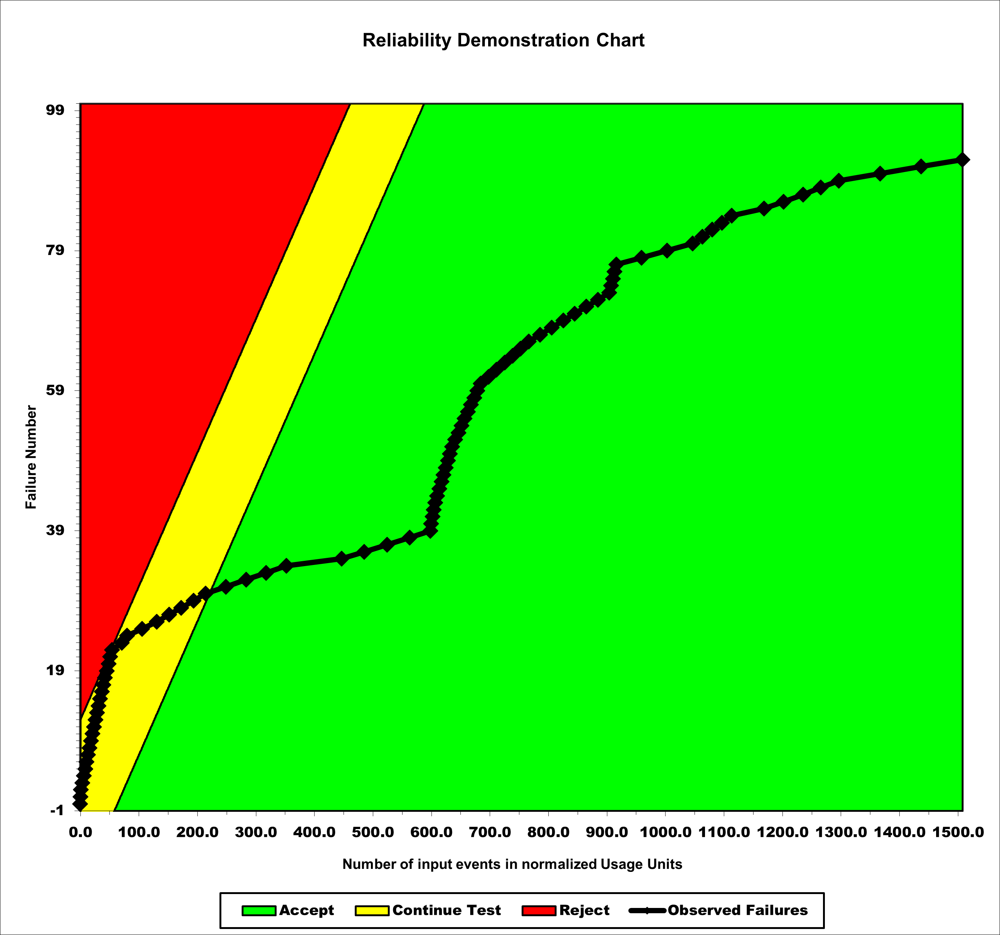
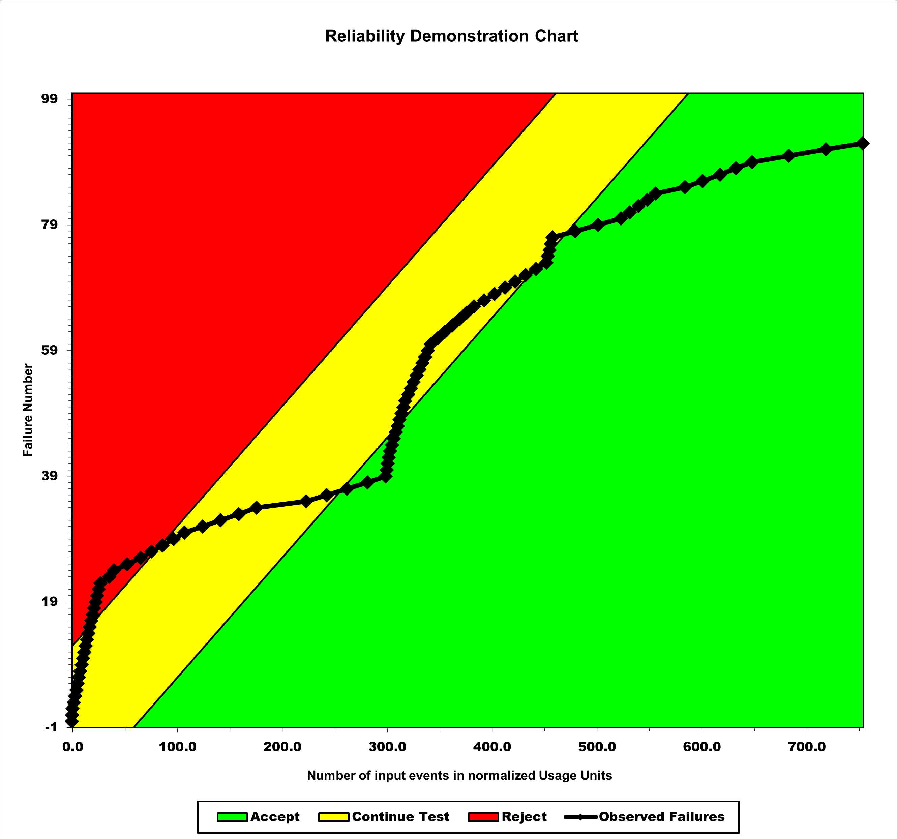
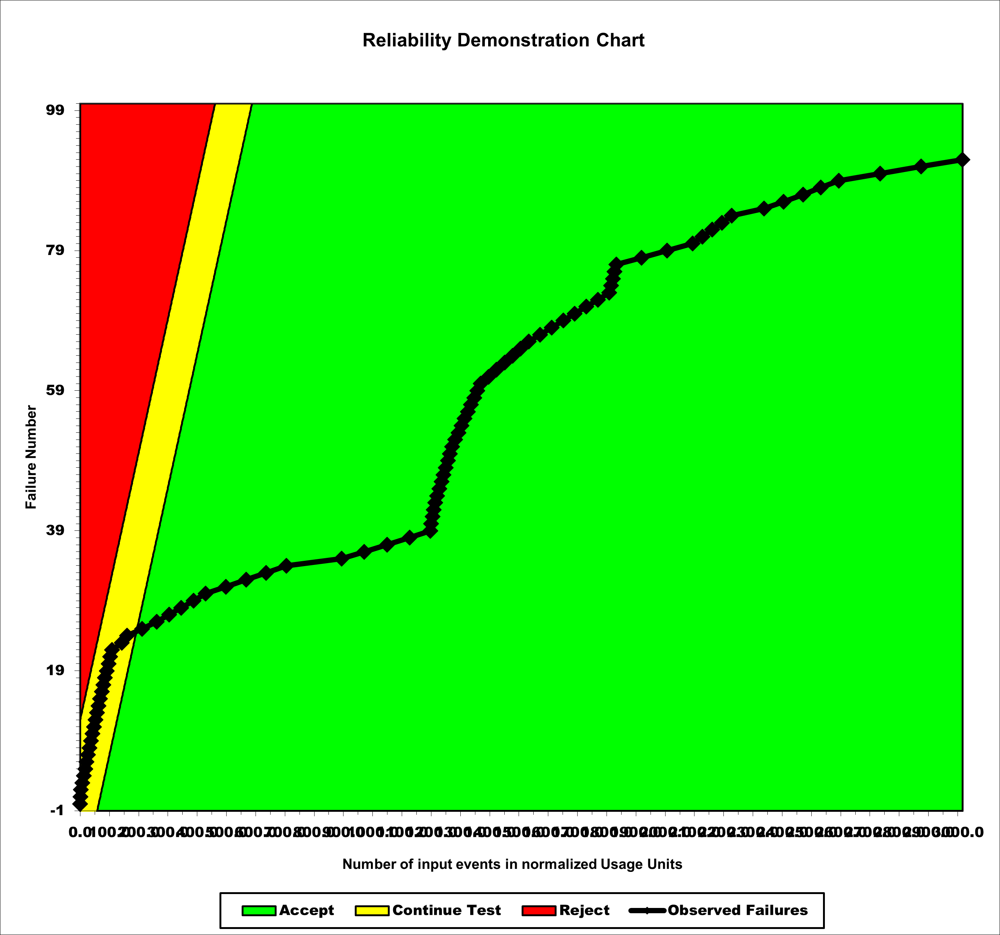

**SENG 637- Dependability and Reliability of Software Systems***

**Lab. Report \#5 – Software Reliability Assessment**

| Group \#:      |  5  |
| -------------- | --- |
| Student Names: | Lawrence |
|                | Kwesi |
|                | Joe |
|                | Zhanzhi |

# Introduction
This lab analyzes integration test failure data using two reliability assessment approaches: Reliability Growth Testing and Reliability Demonstration Charts (RDC). Reliability growth testing models how failure intensity changes over time as faults are detected and fixed, while RDC evaluates whether the system meets specified reliability targets. Together, these methods provide both analytical insight and decision support for assessing the reliability of the system under test (SUT).
# 

# Assessment Using Reliability Growth Testing 

# Assessment Using Reliability Demonstration Chart 

## Plot for MTTFmin

## Plot for twice of MTTFmin

## Plot for half of MTTFmin

# Comparison of Results

# Discussion on Similarity and Differences of the Two Techniques

# How the team work/effort was divided and managed

# 

# Difficulties encountered, challenges overcome, and lessons learned

# Comments/feedback on the lab itself
